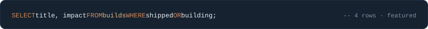
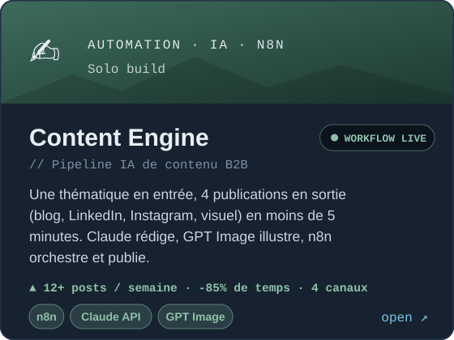
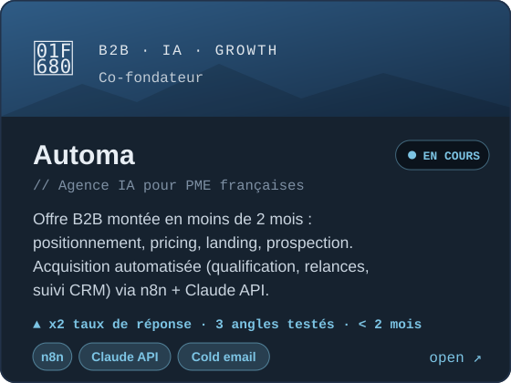
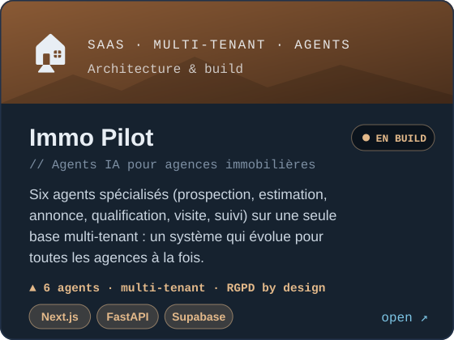
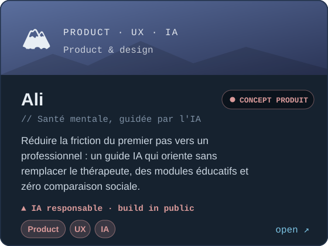
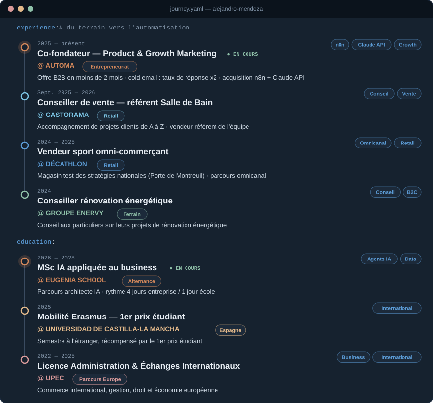
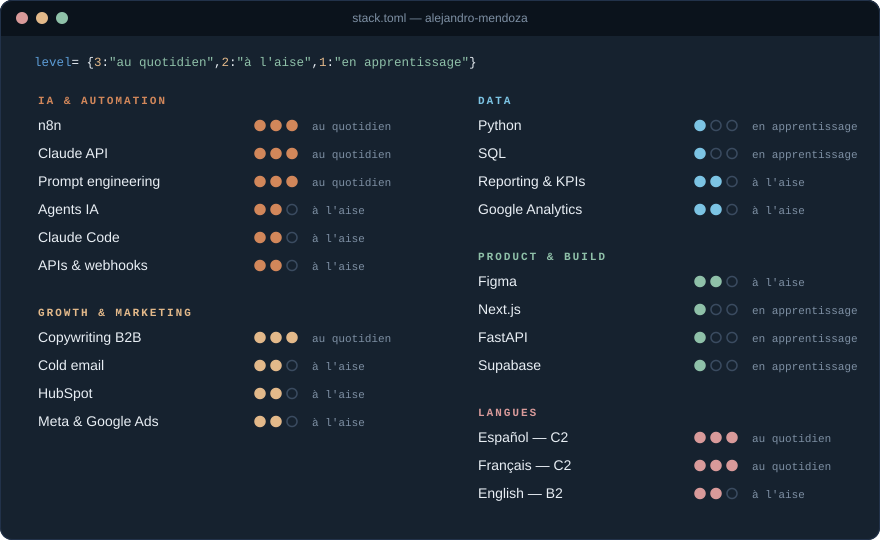

<a href="https://alejandro-mendoza.vercel.app/">
  
</a>

<p align="center">
  <a href="#whoami"></a>
  <a href="#builds"></a>
  <a href="#journey"></a>
  <a href="#stack"></a>
  <a href="#contact"></a>
</p>



<a name="whoami"></a>

## 🏔️ whoami.py

```python
class Alejandro:
    role       = "Automatisation & IA appliquée au business"
    school     = "MSc IA appliquée au business @ Eugenia School (2026 – 2028)"
    background = ["Licence AEI @ UPEC", "Erasmus @ UCLM — 1er prix", "3+ ans de terrain retail"]
    building   = ["Automa — agence IA pour PME", "Immo Pilot — agents IA multi-tenant", "Ali — santé mentale"]
    languages  = {"Español": "C2", "Français": "C2", "English": "B2"}
    looking_for = "Alternance 2 ans · Data & IA · Île-de-France · 4j entreprise / 1j école"

    def why_me(self):
        return "J'ai été en rayon avec des outils décidés ailleurs. Je pars du terrain avant d'automatiser."
```

> La plupart des projets d'automatisation n'échouent pas pour des raisons techniques : ils échouent parce que personne n'a demandé à l'équipe concernée comment elle travaille vraiment.

<a name="builds"></a>

## 🧗 builds.sql



<table>
  <tr>
    <td width="50%"><a href="https://alejandro-mendoza.vercel.app/"></a></td>
    <td width="50%"><a href="https://alejandro-mendoza.vercel.app/"></a></td>
  </tr>
  <tr>
    <td width="50%"><a href="https://alejandro-mendoza.vercel.app/"></a></td>
    <td width="50%"><a href="https://github.com/alejomendozahermida-png/Ali-app"></a></td>
  </tr>
</table>

<details>
  <summary><b>🔓 Autres projets</b></summary>
  <br/>

| Projet | Ce que ça fait | Stack |
|---|---|---|
| 🧭 [Wander](https://github.com/alejomendozahermida-png/WANDER) · [API](https://github.com/alejomendozahermida-png/wander-app) | App de voyage inversée pour étudiants : dates + budget + humeur → une recommandation, pas une liste infinie | TypeScript · Python |
| 💀 Adicción Tequila | Direction artistique de deux campagnes (Día de Muertos, Collection Été), du prototype en argile à l'identité finale | Branding · DA |

</details>

<a name="journey"></a>

## 🗺️ journey.yaml



<a name="stack"></a>

## ⚡ stack.toml



## 📊 stats.py


<picture>
  <source media="(prefers-color-scheme: dark)" srcset="https://raw.githubusercontent.com/alejomendozahermida-png/alejomendozahermida-png/output/snake-dark.svg" />
  <source media="(prefers-color-scheme: light)" srcset="https://raw.githubusercontent.com/alejomendozahermida-png/alejomendozahermida-png/output/snake-light.svg" />
  
</picture>

<a name="contact"></a>

## ✉️ contact.sh

<p align="center">
  <a href="https://alejandro-mendoza.vercel.app/"></a>
  <a href="https://www.linkedin.com/in/alejandro-mendoza-hermida-"></a>
  <a href="mailto:alejomendozahermida@gmail.com"></a>
</p>

<p align="center">
  <code>$ echo "¡Hablemos! · Parlons-en · Let's talk"</code>
</p>
